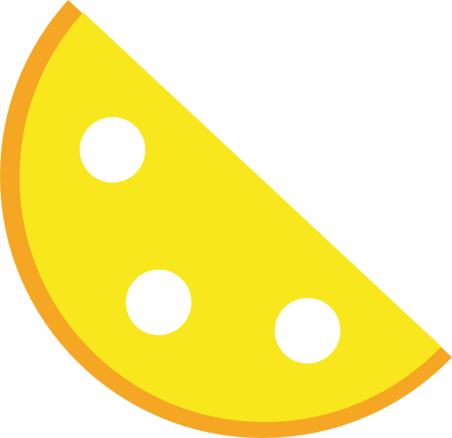

<p align="center">
    <a>
        
    </a>
</p>

<h1>
LimeUI
    <h3>A lightweight Vue.js UI toolkit</h3>
</h1>


# Install

Run the command below in your terminal to install qyuanUI first
```
npm install qyuan-ui --save
```

# Usage

## Global Use
Import in your entry script file and register it
```javascript
import qyuanUI from 'qyuan-ui'
import "qyuan-ui/lib/styles/qyuan-ui.css"

Vue.use(qyuanUI)
```

### Example

```html
<l-button>click</l-button>
```

## On-demand Loading

Firstly, you should install `babel-plugin-component` in your project.
```
npm install babel-plugin-component
```

Configure your `.babelrc` file like this

```json
{
    "plugins": [
        ["component", {
            "libraryName": "qyuan-ui",
            "libDir": "lib",
            "styleLibrary": {
                "name": "styles",
                "base": false, // no base.css file
                "path": "[module].css"
            }
        }]
    ]
}
```

The you can import component on demand, and you don't need to care about importing styles, the babel plugin will do it automaticly.

```javascript
import Vue from 'vue'
import { Button } from 'qyuan-ui'

Vue.component('y-button', Button)
```
